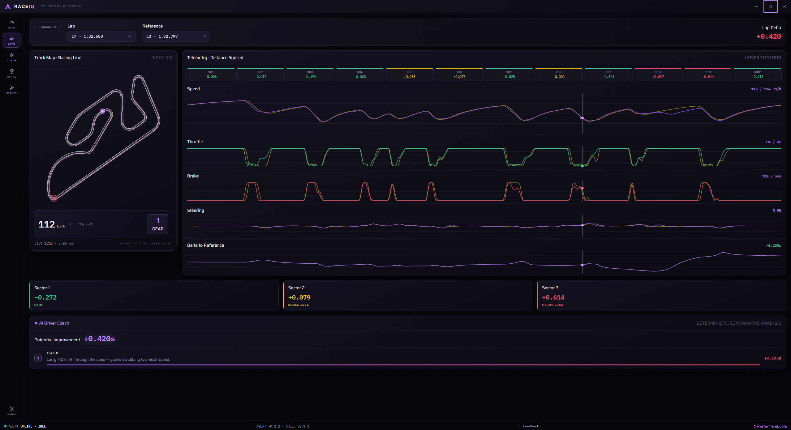
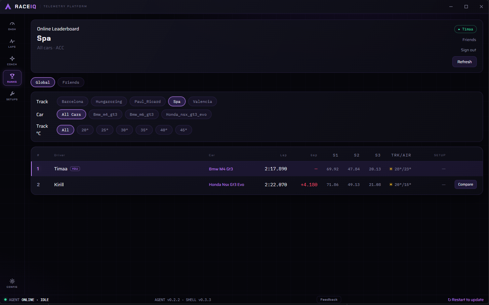
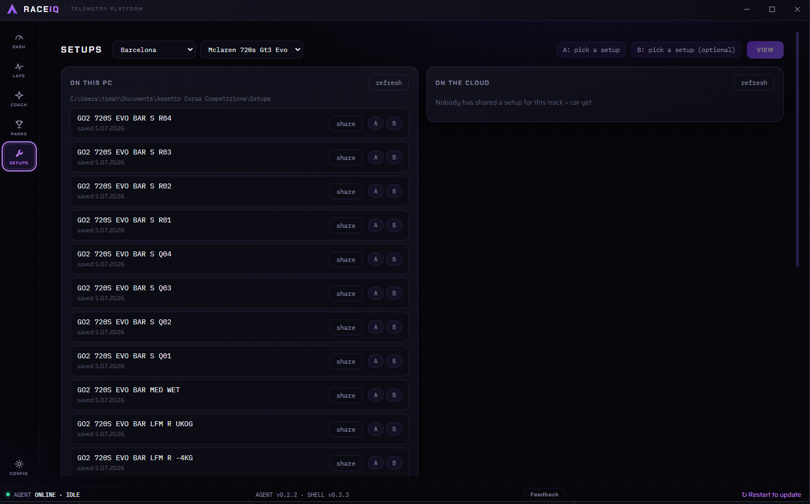
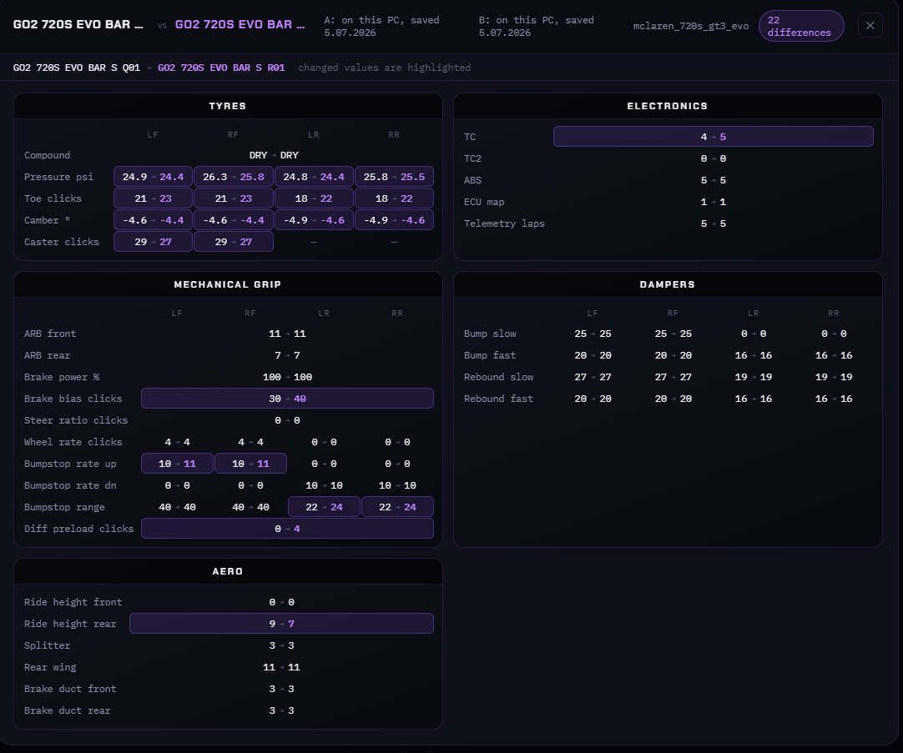
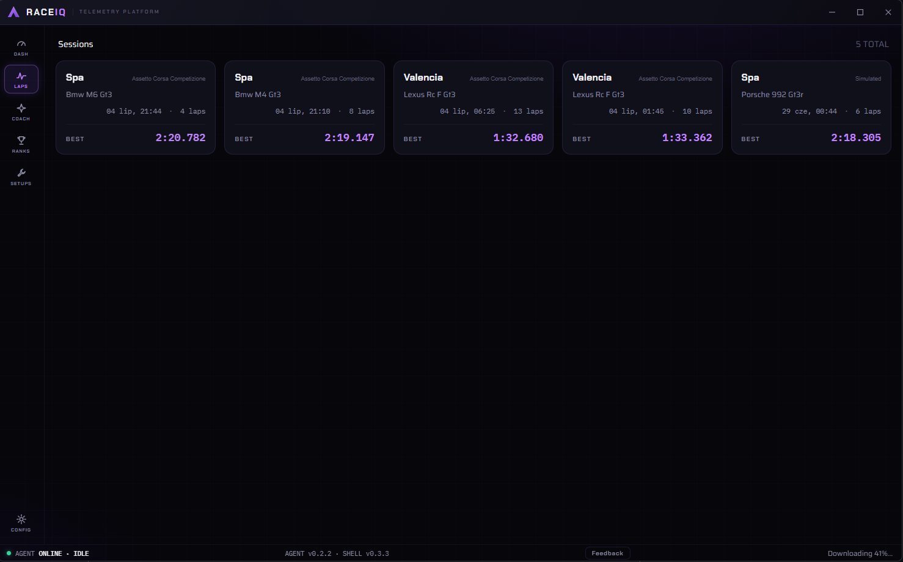
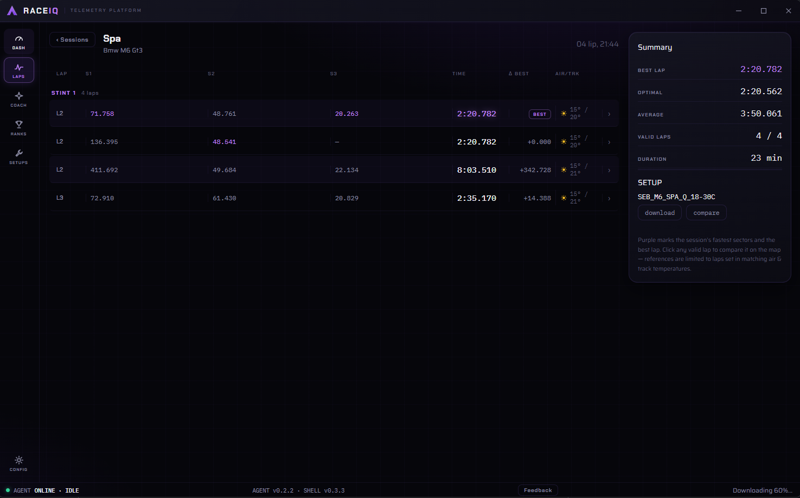
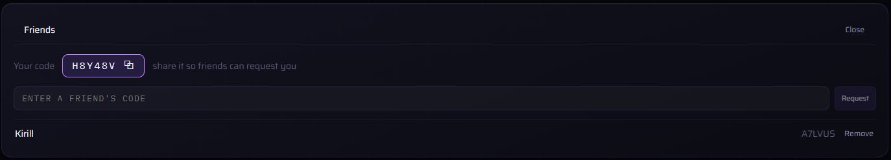
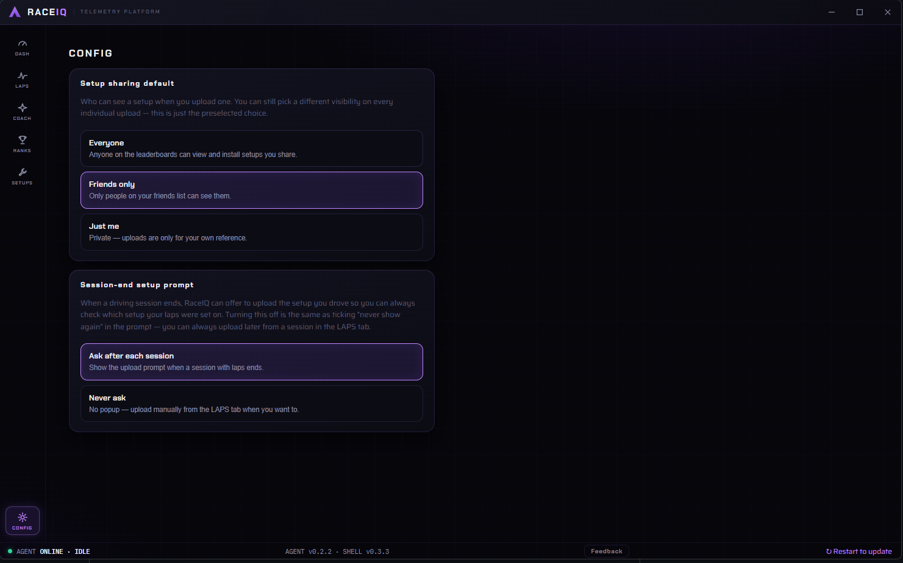
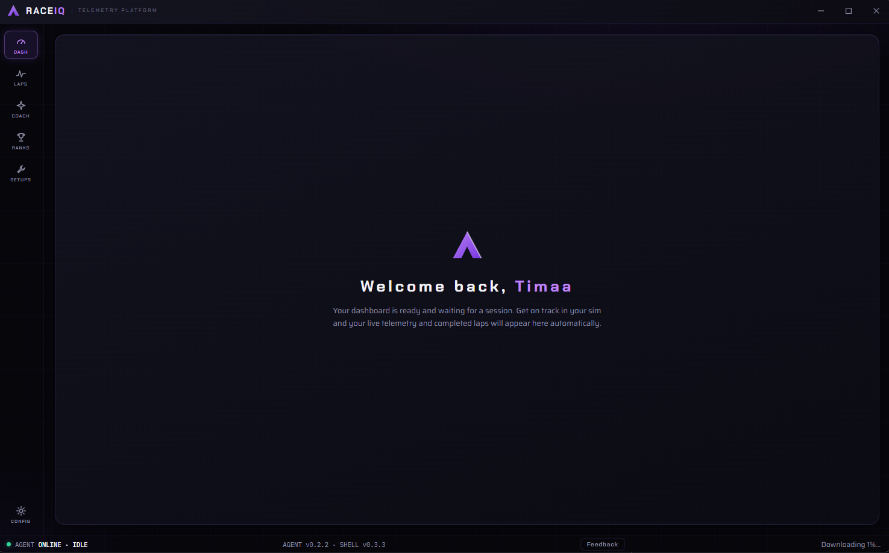

# RaceIQ

### Sim-racing telemetry, analysis & coaching for Windows

Drive, and RaceIQ records every lap, breaks it down corner by corner, tells you exactly where you're losing time, and ranks your best laps on a live leaderboard.

 

---

## What is RaceIQ?

RaceIQ is a desktop app that plugs into your sim and turns raw driving into something you can actually learn from. It combines the tools you'd normally scatter across MoTeC, a coaching service, a setup manager and a leaderboard site into one dark, fast, purpose-built app.

**Local analysis — the track map, traces, sector breakdown and coach — works with no account and no internet.** Only the leaderboard and setup-sharing go online, and only once you sign in.

---

## Features

### Deep lap analysis

Every lap is sliced into micro-sectors and drawn on a distance-synced view: speed, throttle, brake, steering and the delta to your reference, all lined up against a track map with the racing line. Scrub anywhere to see exactly what your hands and feet were doing at that point on track.

### AI driver coach

Fully offline, deterministic corner-by-corner feedback that tells you where the lap time actually went — and how much each fix is worth.

> **Turn 8** — Carry +10 km/h through the apex; you're scrubbing too much speed. *(+0.146s)*

### Online leaderboards

Valid laps upload automatically and rank per **track**, per **car**, and per **track-temperature** band — so you're compared against laps run in the same conditions, not someone's perfect-weather hotlap. Toggle between the **global** board and a **friends-only** board.

### Setups — share, browse & compare

Browse the setups on your PC, then share any of them at the visibility you choose — **Everyone**, **Friends only**, or **Just me**. Pull down setups other drivers have shared for the same car and track straight from the cloud.

Pick any two setups as **A** and **B** and RaceIQ diffs them field by field — tyres, electronics, mechanical grip, dampers and aero — highlighting every changed value so you can see at a glance what actually differs.

### Session history

Every stint is saved and browsable — best lap, optimal lap, average, valid-lap count, duration, the setup you ran and the air/track temps. Jump back into any session to compare laps on the map or grab the setup you drove.

### Friends

Share your code, add friends by theirs, and import their laps to put head-to-head against your own on the track map and traces.

### Config

Set your default setup-sharing visibility and decide whether RaceIQ offers to upload your setup at the end of each driving session.

### Live telemetry & dashboard

Real-time speed, throttle/brake, gear and inputs the moment you go on track — laps and live data appear automatically, no clicking required.

### Auto-updating

The app updates itself in the background, so you're always on the latest build. You can also check on demand from the status bar and restart to apply.

---

## Install

1. Download the latest **`RaceIQ-Setup-x.y.z.exe`** from the [Releases](../../releases) section and run it. It installs per-user — **no admin needed**.
2. Windows SmartScreen will warn because the app isn't code-signed — click **More info → Run anyway**. It's safe; signing is on the roadmap.
3. Launch **RaceIQ** from the Start menu.

Already installed? Do nothing — RaceIQ updates itself and installs the newest build on your next restart.

---

## Getting started

1. Open the **RANKS** tab and create an account (email + password).
2. Hop into **Assetto Corsa Competizione** and drive a clean lap — it uploads automatically and appears on the board. *(Le Mans Ultimate support is in progress.)*
3. Open the **FRIENDS** panel, share your code, and add a friend to compare laps and setups head-to-head.

---

## Requirements

- **Windows 10 / 11** (64-bit)
- For live capture: **Assetto Corsa Competizione** *(Le Mans Ultimate — work in progress)*

Local analysis needs nothing else. The leaderboard and setup-sharing need a free account.

---

## Roadmap

- Code-signing the installer (no more SmartScreen warning)
- Email verification & password reset
- More tracks and sims

---

*Found a bug or have feedback? [Open an issue](../../issues) — it helps a lot.*
